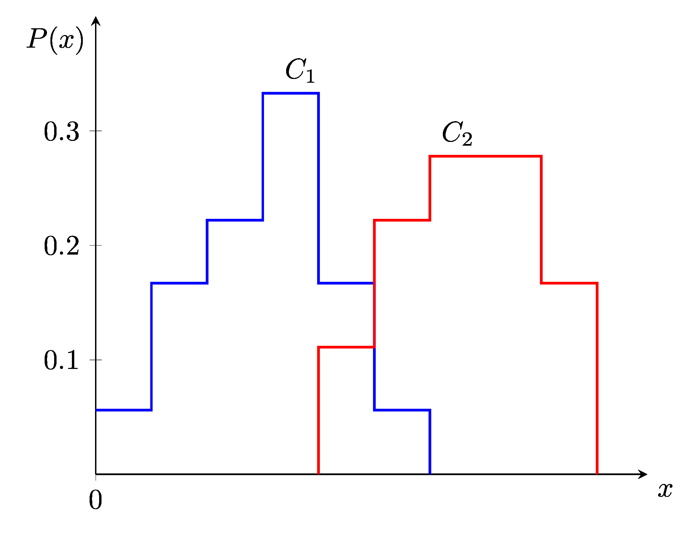
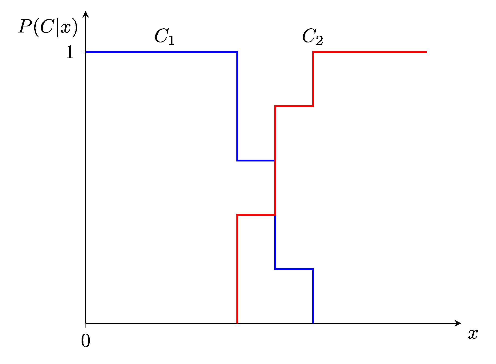

## Bayes' Theorem

Misalkan kita memiliki suatu histogram yang menyatakan hubungan $x$ dengan dua kategori $C_1$ dan $C_2$.



Dalam mendesain suatu algoritma pengklasifikasi berdasarkan data ini, kita ingin mendapatkan $P(C_i|X_j)$, atau peluang $C_i$ dengan syarat bahwa $X_j$ telah terjadi. Disinilah kegunaan *Bayes' Theorem*. 

*Bayes' Theorem* dapat dinyatakan secara matematis dalam persamaan

$$
P(A|B)=\frac{P(B|A) P(A)}{P(B)}
$$

atau dalam kasus yang ini,

$$
P(C_i|X_j)=\frac{P(X_j|C_i) P(C_i)}{P(X_j)}\tag{1.1}
$$

$P(X_j|C_i)$ dapat kita peroleh dengan menghitung banyak $C_i$ yang berada di $X_j$ dan membaginya dengan jumlah keseluruhan $C_i$.

Dengan menggunakan persamaan $(1.1)$, kita dapat menggambar grafik $P(C|x)$.



Disinilah letak pentingnya *Bayes' Theorem*. Kita dapat menghitung hal yang kita inginkan, seperti $P(C|x)$, menggunakan hal yang lebih mudah dihitung, seperti $P(x|C)$.

Kita juga dapat mencari kelas $i$ dimana

$$
P(C_i|\mathbf{x}) \ge P(C_j|\mathbf{x})
$$

untuk semua kelas $j$. Hasil ini sering juga disebut sebagai **maximum a posteriori** atau hipotesis **MAP**.

## Bayes Classifier

*Bayes Classifier*, atau biasa disebut juga sebagai *Bayes Optimal Classifier*, merupakan algoritma yag dapat digunakan untuk menyelesaikan permasalahan **klasifikasi**.

*Bayes Classifier* bekerja dengan cara menempatkan setiap observasi ke **klasifikasi yang paling mungkin** tergantung pada prediktornya. Secara matematis, *Bayes Classifier* bisa dinyatakan dengan

$$
\underset{y\in \mathcal{Y}}{\arg \max}\;P(Y=y|\mathbf{X}=\mathbf{x})
$$

dengan $\mathbf{x}$ merupakan vektor fitur data.

Perlu diperhatikan bahwa **klasifikasi yang paling mungkin** bisa saja berbeda dengan hipotesis **MAP**.

Sebagai contoh, misalkan sebuah tes medis ada tiga kemungkinan kelas, dan kita dapatkan hasil untuk tes tersebut sebagai berikut :

$$
P(C_1|\mathbf{x})=0.4
$$

$$
P(C_2|\mathbf{x})=0.3
$$

$$
P(C_3|\mathbf{x})=0.3
$$

Hipotesis **MAP** dari hasil tersebut adalah $C_1$. Misal akan dilaksanakan suatu prosedur medis jika hasilnya merupakan $C_1$ dan tidak dilaksanakan jika hasilnya $C_2$ atau $C_3$. Pada kasus ini, klasifikasi yang paling mungkin adalah untuk tidak dilaksanakan prosedur medis, karena 

$$
P(\text{prosedur dilaksanakan}|\mathbf{x})=P(C_1|\mathbf{x})=0.4
$$

dan

$$
P(\text{prosedur tidak dilaksanakan}|\mathbf{x})=P(C_2|\mathbf{x})+P(C_3|\mathbf{x})=0.6
$$

Secara rata-rata, tidak ada algoritma *classifier* dengan data yang sama bisa lebih unggul dari *Bayes Classifier*. Sayangnya, perhitungan *Bayes Classifier* kurang mungkin dilakukan di dunia nyata karena kita tidak tahu distribusi hubungan antara data dan klasifikasi. Oleh karena itu, dilakukan estimasi seperti di algoritma *naïve bayes classifier* dan *K-nearest neighbour*.

## Naïve Bayes Classifier

Dari *Bayes Classifier*, kita ingin memaksimalkan 

$$
P(y|\mathbf{x})=\frac{P(\mathbf{x}|y)P(y)}{P(\mathbf{x})}
$$

untuk data $\mathbf{x}$. karena kita hanya tertarik dengan memaksimalkan $P(y|\mathbf{x})$, kita dapat mengabaikan $P(\mathbf{x})$, sehingga kita hanya perlu memaksimalkan

$$
P(y|\mathbf{x})\propto P(\mathbf{x}|y)P(y)\tag{3.1}
$$

Di dunia nyata, menghitung $P(\mathbf{x}|y)$ akan sangat sulit. Oleh karena itu, di *naïve bayes classifier* kita mengestimasikanya dengan berasumsi bahwa masing-masing fitur $x_i$ di $\mathbf{x}$ independen dengan syarat $y$ atau secara matematis, 

$$
P(\mathbf{x}|y)=P(x_1|y)\times P(x_2|y)\times ...\times P(x_n|y)=\prod_k P(x_k|y)
$$

Kita dapat men-subtitusi hasil ini ke persamaan $(3.1)$
  menghasilkan

$$
P(y|\mathbf{x})\propto P(y)\prod_k P(x_k|y)
$$

### Implementasi `python`

Misalkan ada data

```
  deadline  males  sibuk  nubes
0    dekat     ya  tidak  tidak
1     jauh  tidak     ya  tidak
2    dekat  tidak  tidak     ya
3    dekat  tidak     ya     ya
4     jauh     ya     ya  tidak
5     jauh     ya  tidak     ya
6     jauh  tidak  tidak     ya
```

dan kita ingin memprediksi hasil dari `dekat, ya, ya` menggunakan *naïve Bayes*.

Berikut merupakan implementasi *naïve Bayes* di `python`.

```python
import pandas as pd

def Pcon(df, cat_a, a, cat_b, b):
    // df    : data
    // cat_a : categori data a
    // cat_b : categori data b
    // a     : categori data a
    // b     : categori data b

    // Mengasilkan P(a|b)
    return sum(df[df[cat_b] == b][cat_a] == a)/sum(df[cat_b] == b)

def P(df, cat, n):
    // df  : data
    // cat : categori data a
    // n   : categori data a

    // Menghasilkan P(n)
    return sum(df[cat] == n) / df[cat].count()

def naiveBayes(df, x):
    for res in df['nubes'].unique():
        prob = P(df, 'nubes', res)
        for colNum in range(len(x)):
            conProb = Pcon(df, df.columns[colNum], x[colNum], 'nubes', res)
            prob *= conProb
        print(res, prob)

df = pd.read_csv("./data.csv")

naiveBayes(df, ['dekat', 'ya', 'ya'])
```

Menjalankan kode ini akan menghasilkan

```
tidak 0.06349206349206349
ya 0.017857142857142856
```

Berdasarkan hasil ini, didapatkan bahwa `dekat, ya, ya` diklasifikasi sebagai `tidak`.