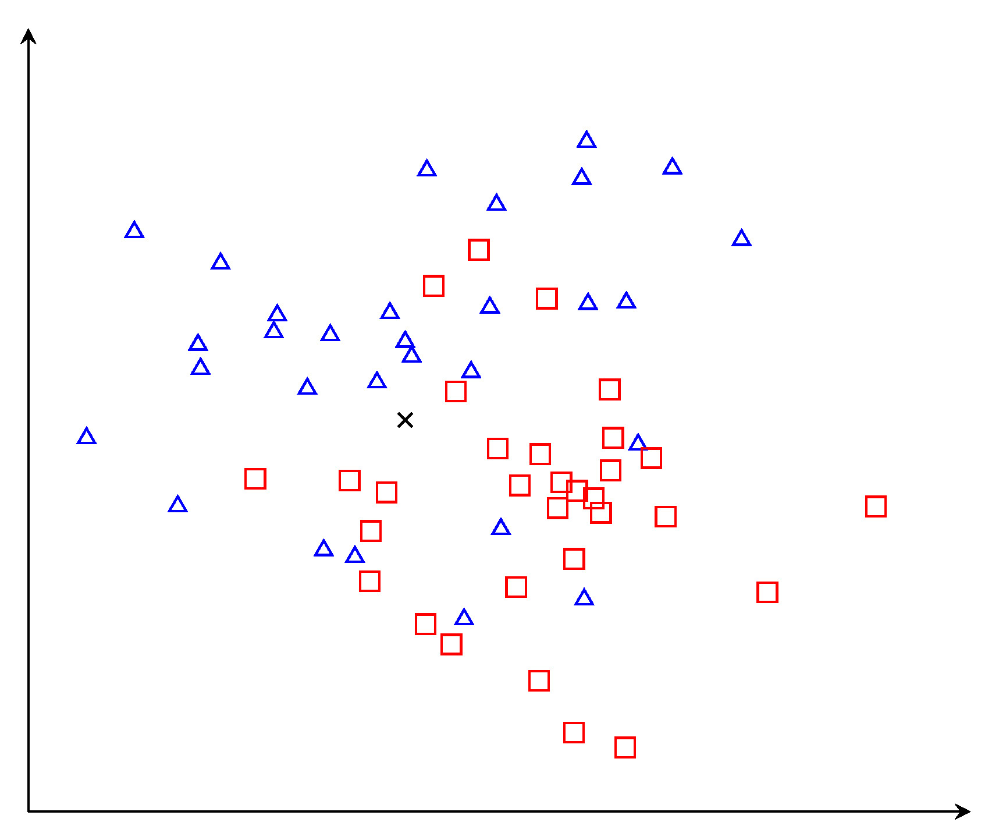
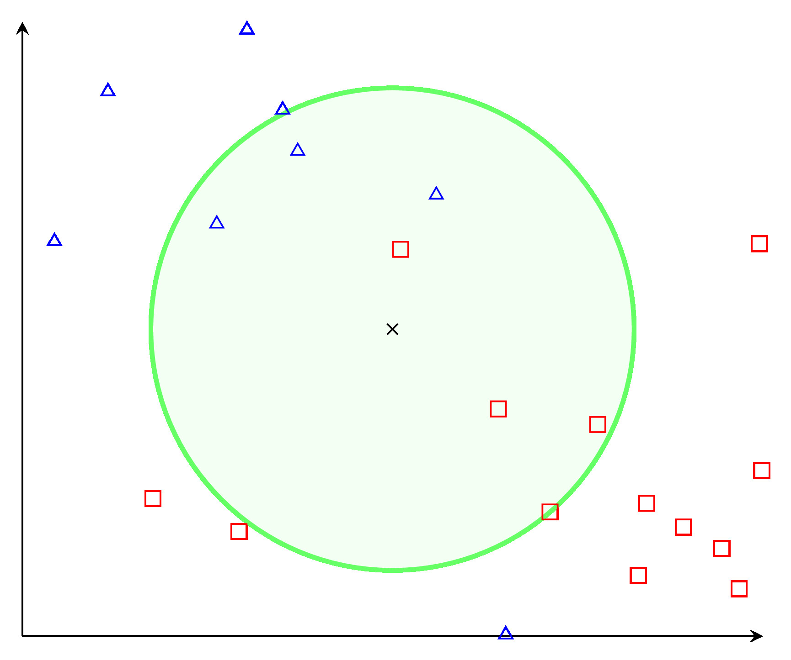
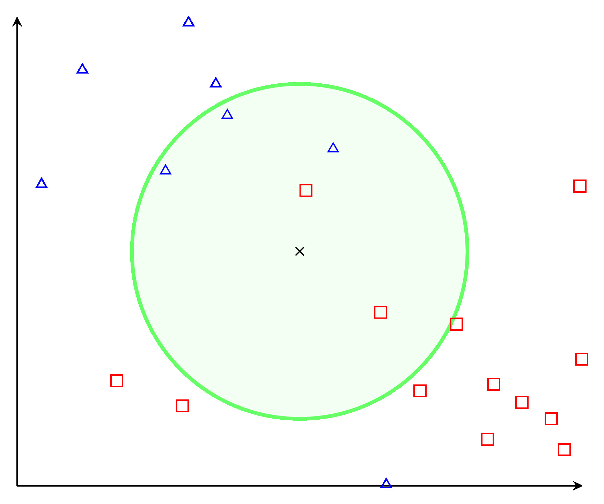

Secara rata-rata, tidak ada algoritma classifier dengan data yang sama bisa lebih unggul dari *Bayes Classifier*. Sayangnya, perhitungan *Bayes Classifier* kurang mungkin dilakukan di dunia nyata karena kita tidak tahu distribusi hubungan antara data dan klasifikasi. *K-nearest neighbor* merupakan salah satu algoritma yang bisa dipakai untuk mengestimasi *Bayes Classifier*.

Dalam *Bayes Classifier*, kita tertarik dengan kemungkinan suatu klasifikasi $y_i$ untuk observasi tertentu $\mathbf{x_j}$ atau secara matematis, 

$$
P(Y=y_i|\mathbf{X}=\mathbf{x_j})
$$

Kita bisa menghitung ini menggunakan *Bayes' Theorem*

$$
P(y_i|\mathbf{x_j})=\frac{P(\mathbf{x_j}|y_i)P(y_i)}{P(\mathbf{x_j})}
$$

Pada kenyataan, $P(\mathbf{x_j}|y_i)P(y_i)$ akan sangat susah untuk dihitung karena kita tidak mengetahui distribusinya. *K-nearest neighbor* mengestimasikan ini dengan cara sebagai berikut:

 1. Ambil suatu nilai $K$.
 2. Untuk setiap test data:
     1. Hitung jarak test data ke setiap training data (Biasanya menggunakan *euclidean distance*).
     2. Urutkan dari yang terkecil ke yang terbesar.
     3. Ambil $K$ data pertama.
     4. Klasifikasikan sebagai modus dari $K$ data tersebut.

Pilihan nilai $K$ akan mempengaruhi hasil klasifikasi dari test data. Sebagai contoh, misalkan kita memiliki training data sebagai berikut:



Data tersebut terdiri dari dua klasifikasi, segitiga biru dan persegi merah. Misalkan kita ingin mencari tahu klasifikasi dari titik $X$.

Misalkan kita memilih $K=7$. Maka, algoritma akan mengambil modus dari $7$ training data terdekat.



Dari grafik tersebut, tujuh data terdekat terdiri dari empat kotak merah dan tiga segitiga biru. Dari sini, kita dapat mengelompokkan $X$ sebagai kotak merah.

Jika kita memilih $K=5$, algoritma akan mengambil modus dari $5$ training data terdekat.



Dari grafik tersebut, lima data terdekat terdiri dari dua kotak merah dan tiga segitiga biru. Dari sini, kita dapat mengelompokkan $X$ sebagai segitiga biru.

Berdasarkan hasil ini, kita dapat menyimpulkan bahwa penting untuk memilih nilai $K$ yang paling optimal sehingga meminimalkan misklasifikasi.

## Implementasi `python`

Data yang akan digunakan adalah data yang sama dengan grafik tadi. Berikut merupakan 10 sampel acak dari data tersebut.

```
         x       y  class
1   30.391  19.079      1
2   28.098  19.382      1
8   21.150  40.940      0
12  29.125  20.485      1
18  27.519  32.761      1
23  28.965  16.136      1
38  10.199  34.994      0
46  24.494  32.192      0
52  21.521  33.569      1
56  17.329  16.257      0
```

`x` merupakan posisi sampel di bidang $x$, `y` merupakan posisi sampel di bidang $y$, dan `class` merupakan klasifikasi dari titik tersebut. `class` bernilai `0` apabila data terklasifikasi sebagai kotak merah dan bernilai `1` apabila data terklasifikasi sebagai segitiga biru.

Berikut merupakan implementasi dari *K-nearest neighbor* di `python`

```python
import pandas as pd
import numpy as np

def euclid_dist(s1, s2):
    return sum([(s1[i] - s2[i]) ** 2 for i in range(max(len(s1), len(s2)))]) ** 0.5

def knn(test_data, X, y, k, dist = euclid_dist):
    # test_data : list test data
    # X         : training data
    # y         : target training data
    # k         : Jumlah nilai teratas yang diambil
    # dist      : tipe jarak
    knn_result = []
    for dt in test_data:
        lt_res = [[dist(dt, (row['x'], row['y'])), y[index]]
                for index, row in X.iterrows()]
        df_res = pd.DataFrame(
            lt_res, columns=['dist', 'class']).sort_values(by=['dist'])
        knn_result += [df_res[:k]['class'].mode()[0]]
    # Modus bisa saja lebih dari satu, oleh karena itu 
    # perlu sejenis tiebreaker. Disini, diambil data modus teratas
    return np.array(knn_result)
```

Dan berikut merupakan perbandingan kode implementasi dengan *K-nearest neighbor* dari library `scikit-learn` menggunakan $K$ dan test data yang acak.

```python
import pandas as pd
import numpy as np
import random
from sklearn.neighbors import KNeighborsClassifier
from knn import *

df = pd.read_csv("data.csv")
X = df[['x', 'y']]
y = df['class']

testd = [[random.randrange(0, 50), random.randrange(0, 50)] for i in range(5)]
# Random test data

k = random.randrange(1, 50)
# Random K

knn_scikit = KNeighborsClassifier(k, metric='euclidean')
knn_scikit.fit(X.to_numpy(), y)

result = \
f"""
K             : {k}
Scikit KNN    : {knn_scikit.predict(testd)}
Implement KNN : {knn(testd, X, y, k)}
"""

print(f"Test Data : {testd}")
print(result)
```

Menjalankan kode diatas akan menghasilkan

```
Test Data : [[18, 21], [27, 42], [16, 12], [37, 10], [9, 17]]

K             : 11
Scikit KNN    : [1 0 1 1 0]
Implement KNN : [1 0 1 1 0]

```
